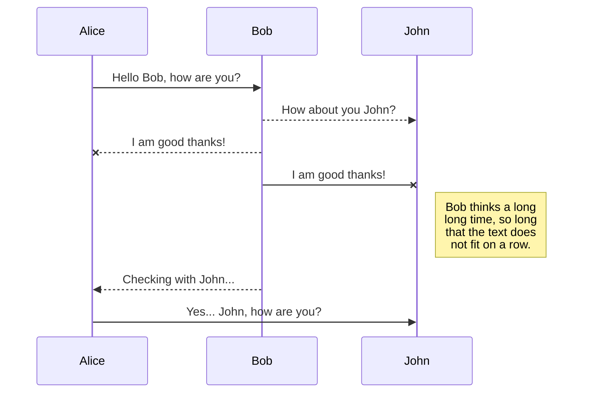
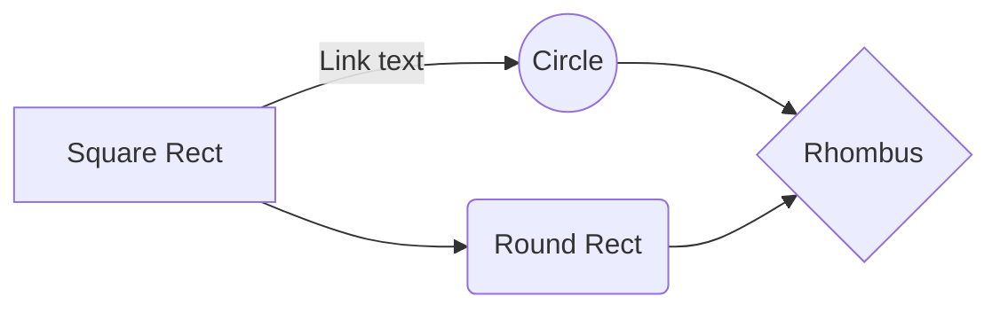

## Markdown 免费编辑器推荐
### Markdown In browser (Online or Offline)

- [StackEdit](https://stackedit.io/app):  markdown editor
- [Modoko](https://www.madoko.net/): Write Beautiful Documents
- [Markdown Here](https://markdown-here.com/):   这是一个Chrome浏览器插件
- [马克飞象](https://maxiang.io/): 专为印象笔记打造的Markdown编辑器（付费）
- [小书匠](http://markdown.xiaoshujiang.com/): 支持第三方数据存储集成(evernote,印象笔记,github,dropbox等)。

<!-- more -->

### Markdown Client

- [Typora](https://pc.qq.com/search.html#!keyword=Typora) (Win+Mac+Linux) : What You See Is What You Get
- [Mou](http://25.io/mou/) (Mac): Markdown editor for developers.
- [Macdown](http://macdown.uranusjr.com/) (Mac): MacDown is an  open source Markdown editor for OS X
- [Bear](http://www.bear-writer.com/)(Mac): Write beautifully on iPhone, iPad, and Mac
- [MarkdownPad](markdownpad.com)(Windows): MarkdownPad is a full-featured Markdown editor for Windows
- [MarkPad](http://code52.org/MarkPadRT/): Markdown works better with MarkPad


### Text Editor
- [Atom](https://atom.io/) (all): A hackable text editor for the 21st Century
- [Sublime Text](http://www.sublimetextcn.com/)  (all): 是程序员圈子里口口相传的「神器」级代码编辑器
- [Notepad++](https://notepad-plus-plus.org/zh/) (Windows): Windows强大的轻量级文本编辑器


## 常用快捷键
加粗        <kbd>Ctrl + B</kbd>
斜体        <kbd>Ctrl + I</kbd>
引用        <kbd>Ctrl + Q</kbd>
插入链接    <kbd>Ctrl + L</kbd>
插入代码    <kbd>Ctrl + K</kbd>
插入图片    <kbd>Ctrl + G</kbd>
提升标题    <kbd>Ctrl + H</kbd>
有序列表    <kbd>Ctrl + O</kbd>
无序列表    <kbd>Ctrl + U</kbd>
横线        <kbd>Ctrl + R</kbd>
撤销        <kbd>Ctrl + Z</kbd>
重做        <kbd>Ctrl + Y</kbd>

## Markdown语法


### 文本处理

| markdown | 效果|
| ----- |------ |
| `*italic* or _italic_` | *italic*  |
| `**bold** or __bold__` | **bold**  |
| `==Marked==`     | ==Marked== |
| ` ~~Mistaken~~ ` | ~~Mistaken~~  |
| `H~2~O`| H~2~O |
| `2^10^`| 2^10^ |
|`<br>`|换行|
|`<u>Underline</u>`|<u>Underline</u>|
|`<kbd>box</kbd>`|<kbd>box</kbd>|
|`<span style="color:red">red</span>` |<span style="color:red">red</span>|

```html
<center>subtitle</center>
<p align="right">right</p>
```
<center>subtitle</center>
<p align="right">right</p>


若想返回markdown符号，只需在前面加 `\` ，如 `\#`

### 标题

Setext-style:
```markdown
Header 1
========
Header 2
--------

# Header 1 
## Header 2 
... ...
###### Header 6
```

### 表格
```markdown
Item | Column 1 | Column 2     |  Column 3 |
-----|:--------:| -------------:|:---------|
Value| centered | right-aligned | left-aligned|
```
| Item  | Column 1 |      Column 2 | Column 3     |
| ----- | :------: | ------------: | :----------- |
| Value | centered | right-aligned | left-aligned |


### 引用

```markdown
> Quoted text
>> Quoted text
```

> Quoted text
>
> > Quoted text

### 列表

**Ordered**

```md
1. Item 1
2. Item 2
```
1. Item 1
2. Item 2

**Unordered**: `-  or *  or + `

```md
- Item 1
- Item 2
```
- Item 1
- Item 2

**Task List**

```md
- [ ] Incomplete item
- [x] Complete item
```
- [ ] Incomplete item
- [x] Complete item

**嵌套列表**

```markdown
*   Abacus
    * answer
*   Bubbles
    1.  bunk
    2.  bupkis
        * BELITTLER
    3. burper
*   Cunning
```
*   Abacus
    * answer
*   Bubbles
    1.  bunk
    2.  bupkis
        * BELITTLER
    3. burper
*   Cunning

### 代码块


```md
`inline code`

​```python
code span
```


### 数学公式
目前流行两套语法支持： LaTeX 语法 (MathJax 渲染) 和 [KaTeX](https://khan.github.io/KaTeX/) 语法
只需要给数学公式添加 `$ or $$` 即可识别。
**Inline:**

```md
The *Gamma function* satisfying $\Gamma(n) = (n-1)!\quad\forall n\in\mathbb N$ is via the Euler integral
```
The *Gamma function* satisfying $\Gamma(n) = (n-1)!\quad\forall n\in\mathbb N$ is via the Euler integral
**Spans:**

```md
$$
\Gamma(z) = \int_0^\infty t^{z-1}e^{-t}dt\,.
$$
```

$$
\Gamma(z) = \int_0^\infty t^{z-1}e^{-t}dt\,.
$$

### 超链接和图片
| markdown | HTML 语法 | 说明|
| :---------| :----- |:-----|
| `[link](http://example.com/ "Title")`|`<a href="http://example.com/" title="Title">`|超链接|
| ``|` `| 图片|

**预定义链接**

```markdownn
[link][id1]
![img][id2]
```
然后，可在文章的任意位置定义链接地址
```md
[id1]: http://example.com/  "Title"
[id2]: /url/to/img.jpg "Title"
```
> 以上title 参数均为可选项

### 音视频
```html
<iframe src="url" title='xxx' scrolling="no" border="0" frameborder="no" framespacing="0" allowfullscreen="true"> </iframe>

<video src="xxx.mp4" />
```

### 注脚

`footnote[^1]`
然后在任意位置定义 `[^1]: This is footnote`

footnote[^1]
[^1]: This is footnote

### YAML Front Matter

```md
---
title: Markdown编辑器推荐及语法
tags: [Markdown]
---
```

### Table of Contents (TOC)
输入 `[toc]` 即可根据标题生成目录。

### 预定义区块
至少4个空格或1个tab

### 分割线
至少3个`---` 或 `***`

### Emoji :smile:

Input emoji with syntax `:smile:`.

### UML diagrams 

You can render UML diagrams using [Mermaid](https://mermaidjs.github.io/). For example, this will produce a sequence diagram:
```md
​```mermaid
sequenceDiagram
Alice ->> Bob: Hello Bob, how are you?
Bob-->>John: How about you John?
Bob--x Alice: I am good thanks!
Bob-x John: I am good thanks!
Note right of John: Bob thinks a long<br/>long time, so long<br/>that the text does<br/>not fit on a row.

Bob-->>Alice: Checking with John...
Alice->>John: Yes... John, how are you?
```



And this will produce a flow chart:
```md
​```mermaid
graph LR
A[Square Rect] -- Link text --> B((Circle))
A --> C(Round Rect)
B --> D{Rhombus}
C --> D
```


