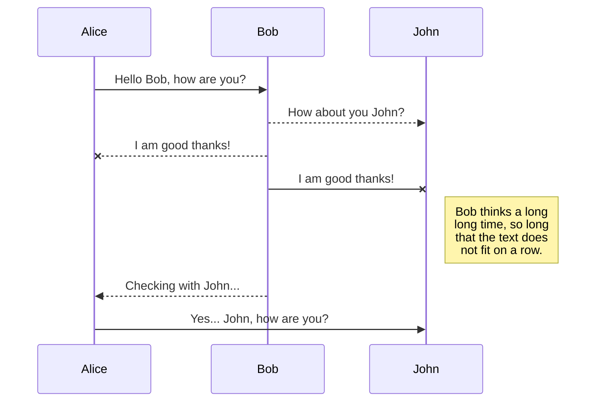
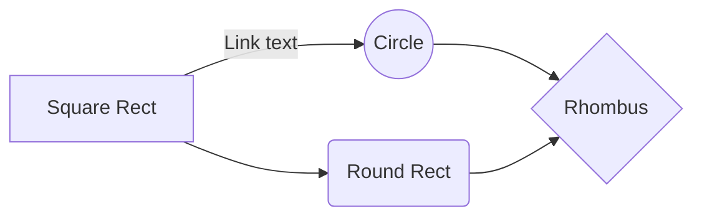

**Markdown**是一种轻量级**标记语言**，它以纯文本形式编写文档，易读（看起来舒服）、易写（语法简单）、易更改，并最终以HTML格式发布。由于markdown没有明确指定语法，随着编译器不一样，实现方式有很大差异。GitHub Flavored Markdown(GFM) 是GitHub基于CommonMark，正式规范了markdown的语法和语义。

<!-- more -->


# Markdown 免费编辑器推荐

## Markdown In browser

- [StackEdit](https://stackedit.io/app):  markdown editor
- [Modoko](https://www.madoko.net/): Write Beautiful Documents
- [Markdown Here](https://markdown-here.com/):   这是一个Chrome浏览器插件
- [马克飞象](https://maxiang.io/): 专为印象笔记打造的Markdown编辑器（付费）
- [小书匠](http://markdown.xiaoshujiang.com/): 支持第三方数据存储集成(evernote,印象笔记,github,dropbox等)。

## Markdown Client

- [Typora](https://pc.qq.com/search.html#!keyword=Typora) (Win+Mac+Linux) : What You See Is What You Get
- [Mou](http://25.io/mou/) (Mac): Markdown editor for developers.
- [Macdown](http://macdown.uranusjr.com/) (Mac): MacDown is an  open source Markdown editor for OS X
- [Bear](http://www.bear-writer.com/)(Mac): Write beautifully on iPhone, iPad, and Mac
- [MarkdownPad](markdownpad.com)(Windows): MarkdownPad is a full-featured Markdown editor for Windows
- [MarkPad](http://code52.org/MarkPadRT/): Markdown works better with MarkPad

## Text Editor

- [Atom](https://atom.io/) (all): A hackable text editor for the 21st Century
- [Sublime Text](http://www.sublimetextcn.com/)  (all): 是程序员圈子里口口相传的「神器」级代码编辑器
- [Notepad++](https://notepad-plus-plus.org/zh/) (Windows): Windows强大的轻量级文本编辑器

# [Markdown语法](https://help.github.com/cn/categories/writing-on-github)

> 通过在 Markdown 字符前面输入`\`，可获得Markdown 字符

## 标题

要创建标题，请在标题文本前添加一至六个 `#` 符号。 您使用的 `#` 数量将决定标题的大小。

```markdown
# Header 1 
## Header 2 
... ...
##### Header 6
```

或者在标题文本下面添加下划线至少三个`=`或`-`表示一级或二级标题。

```markdow
Header 1
========
Header 2
--------
```

HTML 语法

```html
<h1> Header 1 </h1>
<h2> Header 2 </h2>
... ...
<h6> Header 6 </h6>
```

## 文本样式

您可以使用粗体、斜体或删除线文本来表示强调。

| 样式   | 语法               | 快捷键              | 示例               | 输出             |
| ------ | :----------------- | ------------------- | ------------------ | ---------------- |
| 粗体   | `** **` 或 `__ __` | <kbd>Ctrl + B</kbd> | `**bold**`         | **bold**         |
| 斜体   | `* *` 或 `_ _`     | <kbd>Ctrl + I</kbd> | `*italic*`         | *italic*         |
| 删除线 | `~~ ~~`            | <kbd>Ctrl + R</kbd> | `~~mistaken~~`     | ~~mistaken~~     |
| 高亮   | `== ==`            |                     | `==highlight==`    | ==highlight==    |
| 下划线 | HTML标签           |                     | `<u>underline</u>` | <u>underline</u> |
| 下标   | `~ ~`              |                     | `H~2~O`            | H~2~O            |
| 上标   | `^ ^`              |                     | `2^10^`            | 2^10^            |
| 方框   | HTML标签           |                     | `<kbd>box</kbd>`   | <kbd>box</kbd>   |

你也可以用HTML标签表示其他文本样式

```html
<span style="color:red">this text is red</span>
<font face="黑体" color=red size=5>这是红色黑体5号字</font>
```

<span style="color:red">this text is red</span>
<font face="黑体" color=red size=5>这是红色黑体5号字</font>

## 引用

您可以使用 `>` 来引用文本，快捷键 <kbd>Ctrl + Q</kbd>

```markdown
> Quoted text
>> Quoted text
```

> Quoted text
>
> > Quoted text

## 列表

通过在一行或多行文本前面添加 `-` 或 `*` 可创建无序列表。

```markdown
- Item 1
- Item 2
```

- Item 1
- Item 2

要对列表排序，请在每行前面添加一个编号。

```markdown
1. Item 1
2. Item 2
```

1. Item 1
2. Item 2

在每行前面添加`- [ ]`或 `- [x]`标记为任务列表，GFM暂不支持，需采用[HTML语法](#复选框checkboxes)

```markdown
- [ ] Incomplete item
- [x] Complete item
```
<form>
<input type="checkbox" name="vehicle" /> Incomplete item<br />
<input type="checkbox" name="vehicle" checked='checked' /> Complete item
</form>


通过在一个列表项下面缩进一个或多个其他列表项，可创建嵌套列表。

```markdown
*   Abacus
    * answer
*   Bubbles
    1.  bunk
    2.  bupkis
        * BELITTLER
    3. burper
*   Cunning
```

- Abacus
  - answer
- Bubbles
  1. bunk
  2. bupkis
     - BELITTLER
  3. burper
- Cunning

## 代码

如果要标记一小段行内代码，你可以用反引号 (<code>`</code>) 把它包起来，反引号中的文本不会被格式化。

```markdown
`inline code`
```

如果要在代码区段内插入反引号，你可以用多个反引号来开启和结束代码区段，例如

```markdown
``There is a literal backtick (`) here.``
```

如果要插入代码块，需要三个反引号( \`\`\` 或 \~\~\~ )开启和结束，我们建议在代码块的前后各留一个空白行，使原始格式更易辨读。

您可以添加可选的语言标识符，以在代码块中启用语法高亮。

~~~markdown
```python
import sys
print('hello world')
```
~~~

```python
import sys
print('hello world')
```

GFM中还可以显示 `diff`效果，即展示一个文件内容的增加与删除。绿色表示新增，红色表示删除。
在三个反引号后面加上 `diff`标识符，并且其代码块行头以 `+`开头表示新增，`-`开头表示删除。

```diff
+ update today.
- What? When?
```

## 数学公式

你可以使用**MathJax**渲染*LaTeX*数学公式，也可以使用 [KaTeX](https://khan.github.io/KaTeX/) 语法渲染。
如果要写一小段行内数学公式，你可以用 `$` 把它包起来，例如

```markdown
$\begin{aligned}  f(x) &=(m+n)^2 \\ & =m^2+2m+n^2 \end{aligned}$
```
$\begin{aligned}  f(x) &=(m+n)^2 \\ & =m^2+2m+n^2 \end{aligned}$

如果要插入数学公式块，需要两个 `$$`开启和结束，例如

```markdown
$$
\mathbf{V}_1 \times \mathbf{V}_2 =
\begin{vmatrix}
\mathrm{i} & \mathrm{j} & \mathrm{k} \\
\frac{\partial X}{\partial u} &  \frac{\partial Y}{\partial u} & 0 \\
\frac{\partial X}{\partial v} &  \frac{\partial Y}{\partial v} & 0 \\
\end{vmatrix}
$$
```
$$
\mathbf{V}_1 \times \mathbf{V}_2 =
\begin{vmatrix}
\mathrm{i} & \mathrm{j} & \mathrm{k} \\
\frac{\partial X}{\partial u} &  \frac{\partial Y}{\partial u} & 0 \\
\frac{\partial X}{\partial v} &  \frac{\partial Y}{\partial v} & 0 \\
\end{vmatrix}
$$

## 链接

GFM支持行内链接、参考链接和锚点，快捷键为 <kbd>Ctrl + K</kbd>

行内链接：在`[]`里输入链接文本，在其后`()`输入 URL 和 `title`(可选)

```markdown
This is [an example](http://example.com/ "Title") inline link.
```

参考链接

```markdown
This is [an example][id] reference-style link.

<!--在任意位置定义URL-->
[id]: http://example.com/  "Optional Title Here"
```

> 提示：链接文本不必一定是文本。图片或其他 HTML 元素都可以成为链接。

锚点

每一个标题都是一个锚点，也可以用HTML方式定义锚点，不过要注意引用标题锚点时：

- 标题中的英文字母都要被转化为**小写字母**
- 空格换成 `-`
- 去除括号等HTML字符
- 标题名相同时，第2个锚点引用时加后缀，如 `标题-2`
- GFM锚点也支持中文

```markdown
[back to h1](#markdown-in-browser)
```

[back to h1](#markdown-in-browser)

HTML语法格式为

```html
<!--行内链接和参考链接-->
This is <a href="http://example.com/" title="Title">an example</a>

<!--创建锚点(在HTML文档中是不显示的)-->
<h1 id="h1">Header 1</h1>
<a id="tips">back to tips</a>

<!--引用锚点-->
<a href="#tips">back to tips</a>
<!--引用其他页面的锚点-->
<a href="https://help.github.com/nothing.html#tips">back to tips</a>
```

## URLs

GitHub 自动从标准 URL 创建链接。如 http://www.baidu.com
也允许通过标签 `<`brackets`>` 创建链接

`<i@typora.io>` becomes <i@typora.io>.

## 图片

图片的语法和链接相似，需要在链接前添加 `!`，我们可以像这样插入图片

```markdown

```

当然，有时markdown不能满足我们的需求，我们可以采用HTML语法。

```html

```

## 表格

您可以用竖线 `|` 和横线 `-` 创建表格。 横线用于创建每列的标题，而竖线用于分隔每列。 必须在表格前包含空白链接，以便其正确呈现。表格末尾的竖线可选。

您可以在标头行中横线的左侧、右侧或两侧加入冒号 `:`，靠左、靠右或居中对齐列中的文本。

要包含竖线 `|` 作为单元格中的内容，请在竖线前使用 `\`

```markdown
|Item | Column 1 | Column 2     |  Column 3 |
|-----|:--------:| -------------:|:---------|
|Value| centered | right-aligned | left-aligned|
```

| Item  | Column 1 |      Column 2 | Column 3     |
| ----- | :------: | ------------: | :----------- |
| Value | centered | right-aligned | left-aligned |

有时你需要精细化表格，可以用[HTML语法](#表格-2)处理。

## 段落和换行

列表项目可以包含多个段落，每个项目下的段落都必须缩进 4 个空格或是 1 个制表符
通过在文本行之间留一个空白行，可创建新段落。
typora 按Shift+Enter创建一个换行符。然而，大多数的编辑器会忽略单行，为了让其它的Markdown编辑器识别你的换行符，可以在行尾留下两个空格或者插入`<br />`。
HTML语法的段落标签为 `<p>paragraph </p>`

```markdown
1.  This is a list item with two paragraphs. 

    The second paragraph. 

2.  Suspendisse id sem consectetuer libero luctus adipiscing.
```

1. This is a list item with two paragraphs. 

   The second paragraph. 

2. Suspendisse id sem consectetuer libero luctus adipiscing.

如果要在列表项目内放进引用，那 `>` 就需要缩进4 个空格或是 1 个制表符：

```markdown
*   A list item with a blockquote:
    > This is a blockquote
    > inside a list item.
```

- A list item with a blockquote:

  > This is a blockquote
  > inside a list item.

## Emoji :smile:

通过键入 `:EMOJICODE:` 可在您的写作中添加表情符号。
`@octocat :+1: This PR looks great`
@octocat :+1: This PR looks great

键入 `:` 将显示建议的表情符号列表。 列表将在您键入时进行过滤，因此一旦找到所需表情符号，请按 **Tab** 或 **Enter** 键以填写选中的结果。

:sunny: :snowflake: :cloud: :zap: :heart: :heartbeat: :train2: :airplane: :bus: :taxi: :car: :ship: :white_check_mark: :white_medium_square: :white_large_square: :white_circle: :red_circle:

有关可用表情符号和代码的完整列表，请查看 [emoji-cheat-sheet.com](http://emoji-cheat-sheet.com/)。

## 注脚

```markdown
You can create footnotes like this[^footnote].

[^footnote]: Here is the *text* of the **footnote**.
```

You can create footnotes like this[^footnote].

[^footnote]: Here is the *text* of the **footnote**.

注脚内容将会在底部看到。

## 水平线

至少3个`---` 或 `***`可形成水平线
HTML 标签`<hr>` 在页面中创建水平线

------

## YAML Front Matter

Typora 支持YAML Front Matter，在文章顶部输入`---`开始和结束。

```yaml
---
title: Markdown编辑器推荐及语法
tags: [Markdown]
---
```

## Table of Contents (TOC)

StackEdit 支持生成目录，输入 `[toc]` 即可根据标题生成目录，可自动更新。

## UML diagrams

You can render UML diagrams using [Mermaid](https://mermaidjs.github.io/).

~~~markdown

~~~


sequenceDiagram
Alice ->> Bob: Hello Bob, how are you?
Bob-->>John: How about you John?
Bob--x Alice: I am good thanks!
Bob-x John: I am good thanks!
Note right of John: Bob thinks a long<br/>long time, so long<br/>that the text does<br/>not fit on a row.

Bob-->>Alice: Checking with John...
Alice->>John: Yes... John, how are you?


And this will produce a flow chart:


~~~markdown

~~~


graph LR
A[Square Rect] -- Link text --> B((Circle))
A --> C(Round Rect)
B --> D{Rhombus}
C --> D



# 部分HTML语法

Markdown兼容HTML，不在 Markdown 涵盖范围之内的标签，都可以直接在文档里面用 HTML 撰写。不需要额外标注。能制约的只有一些 HTML 区块元素――比如 `<div>`、`<table>`、`<pre>`、`<p>` 等标签，必须在前后加上空行与其它内容区隔开，还要求它们的开始标签与结尾标签不能用制表符或空格来缩进。

HTML 的区段（行内）标签如 `<span>`、`<cite>`、`<del>` 可以在 Markdown 的段落、列表或是标题里随意使用。依照个人习惯，甚至可以不用 Markdown 格式，而直接采用 HTML 标签来格式化。

## 注释

```html
<!--HTML 注释-->
```

## note标签

```html
<div class="note [class] [no-icon]"><p>content</p></div>
[class]   : default | primary | success | info | warning | danger.
[no-icon] : Disable icon in note.
```

<div class="note danger"><p>danger</p></div>

## 文本背景色

```html
<form>
<table><tr><td bgcolor=yellow>背景色</td></tr></table>
</form>
```
<form>
<table><tr><td bgcolor=yellow>背景色</td></tr></table>
</form>

## 对齐方式

```html
<form>
<center>居中</center>
<p align="right">右对齐</p>
</form>
```

<form>
<center>居中</center>
<p align="right">右对齐</p>
</form>

## 单选按钮(Radio Buttons)

`<input type="radio">` 标签定义了表单单选框选项

```html
<form>
<input type="radio" name="sex" value="male" checked='checked' /> Male<br>
<input type="radio" name="sex" value="female" /> Female
</form>
```
<form>
<input type="radio" name="sex" value="male" checked='checked' /> Male<br>
<input type="radio" name="sex" value="female" /> Female
</form>

## 复选框(Checkboxes)

`<input type="checkbox">` 定义了复选框. 用户需要从若干给定的选择中选取一个或若干选项。

```html
<form>
<input type="checkbox" name="vehicle" value="Bike" checked='checked' /> I have a bike<br />
<input type="checkbox" name="vehicle" value="Car" /> I have a car
</form>
```
<form>
<input type="checkbox" name="vehicle" value="Bike" checked='checked' /> I have a bike<br />
<input type="checkbox" name="vehicle" value="Car" /> I have a car
</form>

## 表格

```html
<table width="300" border="1" style="text-align:left;">
<caption>title</caption>
<!--border 定义边框-->
<!--text-align:对齐方式 left|right|center-->
    <tr>
        <th>header 1</th>
        <th>header 2</th>
    </tr>
    <tr>
        <td>row1,col1</td>
        <td>row1,col2</td>
    </tr>
    <tr>
        <td>row2,col1</td>
        <td>row2,col2</td>
    </tr>    
</table>
```
```html
<!--合并单元格-->
<table border="1">
<tr>
  <th>Name</th>
  <th colspan="2">Telephone</th>
</tr>
<tr>
  <td>Bill Gates</td>
  <td>911</td>
  <td>110</td>
</tr>
</table>

<table border="1">
<tr>
  <th>First Name:</th>
  <td>Bill Gates</td>
</tr>
<tr>
  <th rowspan="2">Telephone:</th>
  <td>911</td>
</tr>
<tr>
  <td>110</td>
</tr>
</table>
```
<table border="1">
<tr>
  <th>Name</th>
  <th colspan="2">Telephone</th>
</tr>
<tr>
  <td>Bill Gates</td>
  <td>911</td>
  <td>110</td>
</tr>
</table>

<table border="1">
<tr>
  <th>Name:</th>
  <td>Bill Gates</td>
</tr>
<tr>
  <th rowspan="2">Telephone:</th>
  <td>911</td>
</tr>
<tr>
  <td>110</td>
</tr>
</table>

## HTML 框架

通过使用框架，你可以在同一个浏览器窗口中显示不止一个页面。

```html
<iframe src="url" title='xxx' scrolling="no" border="0" frameborder="no"
  framespacing="0" allowfullscreen="true"> </iframe>
```

## 音视频

```html
<video src="xxx.mp4" />
```
你可以在各大视频网站的分享入口，找到嵌入的 HTML 代码。


## Font Awesome

[Font Awesome](http://www.fontawesome.com.cn/) 提供一套免费可缩放矢量图标，它可以被定制大小、颜色、阴影以及任何可以用CSS的样式。

```html
<i class="fa fa-download"></i>
```

<table style="text-align:left;">
<caption>部分图标</caption>

<tr>
<td><i class="fa fa-home"></i><br />home</td>
<td><i class="fa fa-tags"></i><br />tags</td>
<td><i class="fa fa-th"></i><br />th</td>
<td><i class="fa fa-archive"></i><br />archive</td>
<td><i class="fa fa-windows"></i><br />windows</td>
<td><i class="fa fa-send"></i><br />send</td>
</tr>
<tr>
<td><i class="fa fa-film"></i><br />film</td>
<td><i class="fa fa-youtube-play"></i><br />youtube-play</td>
<td><i class="fa fa-photo"></i><br />photo</td>
<td><i class="fa fa-microphone"></i><br />microphone</td>
<td><i class="fa fa-music"></i><br />music</td>
<td><i class="fa fa-fire"></i><br />fire</td>
</tr>
<tr>
<td><i class="fa fa-star"></i><br />star</td>
<td><i class="fa fa-bookmark"></i><br />bookmark</td>
<td><i class="fa fa-user"></i><br />user</td>
<td><i class="fa fa-group"></i><br />group</td>
<td><i class="fa fa-heart"></i><br />heart</td>
<td><i class="fa fa-heartbeat"></i><br />heartbeat</td>
</tr>
<tr>
<td><i class="fa fa-download"></i><br /> download</td>
<td><i class="fa fa-cloud-upload"></i><br /> cloud-upload</td>
<td><i class="fa fa-calendar"></i><br /> calendar</td>
<td><i class="fa fa-book"></i><br /> book</td>
<td><i class="fa fa-bolt"></i><br /> bolt</td>
<td><i class="fa fa-bug"></i><br /> bug</td>
</tr>
<tr>
<td><i class="fa fa-crosshairs"></i><br /> crosshairs</td>
<td><i class="fa fa-expand"></i><br /> expand</td>
<td><i class="fa fa-code"></i><br /> code</td>
<td><i class="fa fa-file"></i><br /> file</td>
<td><i class="fa fa-folder"></i><br /> folder</td>
<td><i class="fa fa-edit"></i><br /> edit</td>
</tr>
<tr>
<td><i class="fa fa-list"></i><br /> list</td>
<td><i class="fa fa-list-ol"></i><br /> list-ol</td>
<td><i class="fa fa-tasks"></i><br /> tasks</td>
<td><i class="fa fa-heart"></i><br /> heart</td>
<td><i class="fa fa-heartbeat"></i><br /> heartbeat</td>
<td><i class="fa fa-leaf"></i><br /> leaf</td>
</tr>
<tr>
<td><i class="fa fa-hourglass"></i><br /> hourglass</td>
<td><i class="fa fa-hourglass-half"></i><br /> hourglass-half</td>
<td><i class="fa fa-lock"></i><br /> lock</td>
<td><i class="fa fa-unlock"></i><br /> unlock</td>
<td><i class="fa fa-location-arrow"></i><br /> location-arrow</td>
<td><i class="fa fa-map-signs"></i><br /> map-signs</td>
</tr>
<tr>
<td><i class="fa fa-paper-plane"></i><br /> paper-plane</td>
<td><i class="fa fa-paw"></i><br /> paw</td>
<td><i class="fa fa-superpowers"></i><br /> superpowers</td>
<td><i class="fa fa-key"></i><br /> key</td>
<td><i class="fa fa-thumbs-up"></i><br /> thumbs-up</td>
<td><i class="fa fa-thumbs-down"></i><br /> thumbs-down</td>
</tr>
<tr>
<td><i class="fa fa-tint"></i><br /> tint</td>
<td><i class="fa fa-toggle-off"></i><br /> toggle-off</td>
<td><i class="fa fa-toggle-on"></i><br /> toggle-on</td>
<td><i class="fa fa-tree"></i><br /> tree</td>
<td><i class="fa fa-trophy"></i><br /> trophy</td>
<td><i class="fa fa-university"></i><br /> university</td>
</tr>
<tr>
<td><i class="fa fa-info"></i><br />info</td>
<td><i class="fa fa-info-circle"></i><br />info-circle</td>
<td><i class="fa fa-globe"></i><br />globe</td>
<td><i class="fa fa-internet-explorer"></i><br />internet-explorer</td>
<td><i class="fa fa-pencil"></i><br />pencil</td>
<td><i class="fa fa-cog"></i><br />cog</td>
</tr>
</table>

 