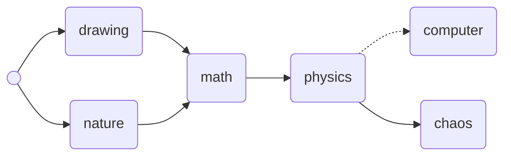

本博客基于 Hexo 及 GitBook 配合搭建而成。
其中博文依据个人爱好、工作需要等制定了一份详细的学习计划，并根据清单同步更新学习笔记，详情请查阅「[书架](https://wilenwu.github.io/bookshelf.html)」。

[Hexo](https://hexo.io/zh-cn/) 是高效的静态站点生成框架，基于 [Node.js](https://nodejs.org/)。 通过 Hexo 你可以轻松地使用 Markdown 编写文章，除了 Markdown 本身的语法之外，还可以使用 Hexo 提供的 [tag 插件](https://hexo.io/zh-cn/docs/tag-plugins.html) 来快速的插入特定形式的内容。Hexo 还拥有丰富的主题和插件。

[GitBook](https://www.gitbook.com/) 是一个基于 [Node.js](https://nodejs.org/) 的命令行工具，支持 Markdown 和 AsciiDoc 两种语法格式，可以输出 HTML、PDF、eBook 等格式的电子书。你可以使用 GitBook 管理文档，预览、制作电子书，同时通过 Git 管理书籍内容的变更，并将其托管到 GitHub、GitLab、码云等平台。GitBook 还拥有内容丰富的插件系统。

# 职业规划

# 兴趣爱好

# 绘画墙


  
  
  
  
  
  


------

**建站参考链接：**
[Blankj's Blog](https://blankj.com/)
[DP2PX.COM](https://dp2px.com/)

[【Gitbook】实用配置及插件介绍](https://www.cnblogs.com/zhangjk1993/p/5066771.html)
[GitBook插件整理 - book.json配置](https://www.cnblogs.com/mingyue5826/p/10307051.html)
[推荐12个实用的gitbook插件 - 大师兄 - CSDN博客](https://blog.csdn.net/weixin_37865166/article/details/91899788)

<!--职业规划 markdown

<table border="1" class="font">

<tr>
  <th colspan="2">阶段</th>
  <th>数据分析助理</th>
  <th>数据分析师</th>
  <th>高级数据分析师</th>
  <th>资深数据分析师</th>
  <th>数据分析专家</th>
</tr>
<tr>
  <th rowspan="6">业务能力</td>
  <th>商业理解</th>
  <td>指导下</td><td>独立清晰准确理解任务</td><td>洞悉业务</td><td></td><td></td>
</tr>
<tr>
  <th>方案规划</th>
  <td>指导下</td><td>独立清晰方案制定</td><td>业务技术深度融合</td><td></td><td></td>
</tr>
<tr>
  <th>数据准备</th>
  <td>基本数据分析</td><td>熟悉数据的缺失值、极值、变换等</td><td>帮助其他分析师进行数据处理</td><td>指导</td><td></td>
</tr>
<tr>
  <th>分析建模</th>
  <td>统计分析</td><td>统计分析、挖掘建模</td><td>帮助其他分析师进行分析建模</td><td>指导</td><td></td>
</tr>
<tr>
  <th>解释展示</th>
  <td>完成分析报告，结论正确</td><td>结论清晰，业务解释性好</td><td>结论清晰，业务理解性好</td><td></td><td></td>
</tr>
<tr>
  <th>价值应用</th>
  <td>完成业务需求，提出建议</td><td>提出建议，推动采纳</td><td>提出有效建议，解决业务问题</td><td>提出有效建议，解决业务问题</td><td>思考数据价值，并有效推动</td>
</tr>
<tr>
  <th colspan="2">执行能力</th>
  <td>完成指定任务</td><td>完成指定任务</td><td>独立完成难度大项目</td><td>独立完成难度大项目，解决疑难</td><td>独立完成难度较大项目，解决疑难问题，指导重点项目</td>
</tr>
<tr>
  <th colspan="2">管理能力</th>
  <td></td><td>团队重要成员，协同项目进度质量</td><td>团队重要成员，控制项目进度质量</td><td>跨团队项目协调</td><td>带领团队</td>
</tr>
<tr>
  <th colspan="2">影响力</th>
  <td></td><td></td><td>团队影响力</td><td></td><td>部门公司层面有影响力</td>
</tr>
<tr>
  <th rowspan="2" colspan="2">专业要求</th>
  <td>统计学</td><td>统计学，多元统计学，时间序列</td><td>理解</td><td>深入理解</td><td></td>
</tr>
<tr>
  <td>熟练excel，熟悉SQL,Hive</td><td>熟练SAS/R/Python之一，熟练Linux</td><td>熟练tableau/hadoop/spark</td><td>熟练tensorflow</td><td></td>
</tr>

</table>
-->