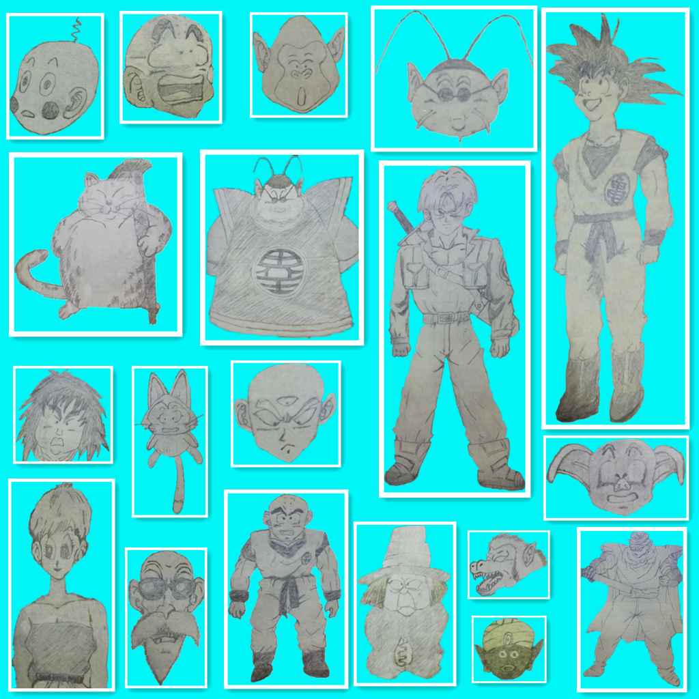

本博客基于 Hexo 及 GitBook 配合搭建而成。
其中博文依据个人爱好、工作需要等制定了一份详细的学习计划，并根据清单同步更新学习笔记，详情请查阅「[书架](https://wilenwu.github.io/bookshelf.html)」。

[Hexo](https://hexo.io/zh-cn/) 是高效的静态站点生成框架，基于 [Node.js](https://nodejs.org/)。 通过 Hexo 你可以轻松地使用 Markdown 编写文章，除了 Markdown 本身的语法之外，还可以使用 Hexo 提供的 [tag 插件](https://hexo.io/zh-cn/docs/tag-plugins.html) 来快速的插入特定形式的内容。Hexo 还拥有丰富的主题和插件。

[GitBook](https://www.gitbook.com/) 是一个基于 [Node.js](https://nodejs.org/) 的命令行工具，支持 Markdown 和 AsciiDoc 两种语法格式，可以输出 HTML、PDF、eBook 等格式的电子书。你可以使用 GitBook 管理文档，预览、制作电子书，同时通过 Git 管理书籍内容的变更，并将其托管到 GitHub、GitLab、码云等平台。GitBook 还拥有内容丰富的插件系统。

# 兴趣爱好


graph LR
O(( )) --小学--> B(科学)
O(( )) -.-> B1(绘画)
B --初中--> C(数学)
C --高中--> D(物理)
D -.-> E2(混沌)
D --大学--> E(理论物理)
D -.-> E3(计算机)
E3 -.-> F3(数据分析)

<!--兴趣爱好英文版请参考draft.md-->

# 职业规划

<!--职业规划HTML table版请参考draft.md-->

# 绘画墙



 



------

**建站参考链接：**
[Github+Hexo搭建专属自己的博客](https://www.linjiujiu.xyz/2018/12/10/Github-Hexo%E6%90%AD%E5%BB%BA%E4%B8%93%E5%B1%9E%E8%87%AA%E5%B7%B1%E7%9A%84%E5%8D%9A%E5%AE%A2/)
[Blankj's Blog](https://blankj.com/)
[DP2PX.COM](https://dp2px.com/)
[Leesin' Blog](https://ilxx.gitee.io/)

[Gitboo使用教程](https://gitbook.zhangjikai.com/)
[【Gitbook】实用配置及插件介绍](https://www.cnblogs.com/zhangjk1993/p/5066771.html)
[GitBook插件整理](https://www.jianshu.com/p/427b8bb066e6)
[推荐12个实用的gitbook插件 - 大师兄 - CSDN博客](https://blog.csdn.net/weixin_37865166/article/details/91899788)
[Gitbook 使用入门](https://www.bookstack.cn/books/gitbook-zh)

